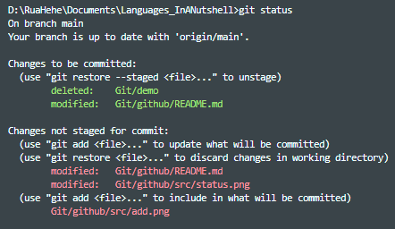
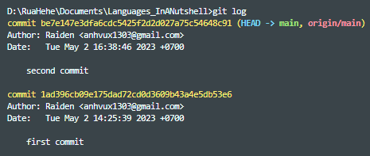
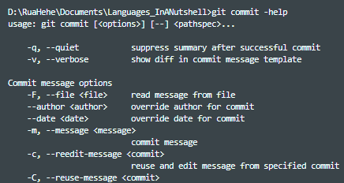
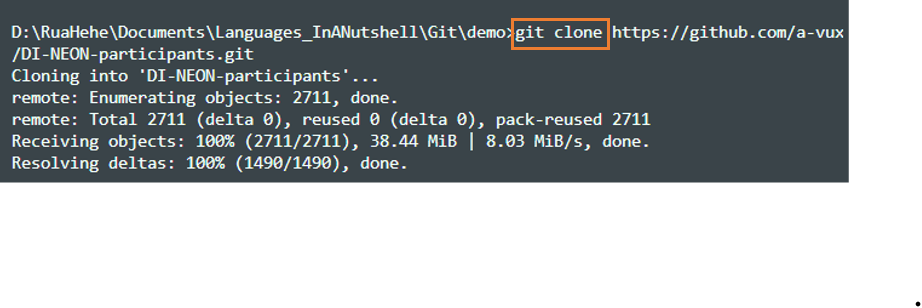
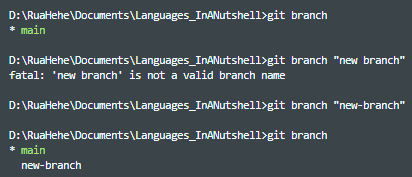
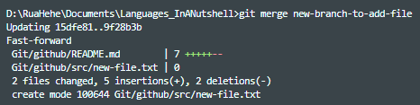

# **What is Git?**
- A Version Control System (VCS) for ***tracking changes*** in files, or codes to be specific
- To be specific, Git is a ***distributed/decentralized*** VCS (devs can work on a same project without having to be in the same network)
- Link download: https://git-scm.com/downloads
(or `sudo apt-get install git` for Linux OS)

# **Some terms:**
- *Central repository* : a repository where all participants add their changes to. It is known as the "final working version" of the project
- *Forked repository* : a personal working copy of the central repository stored in your Github account (also called a ***fork***)
- *Local/Cloned repository* : a local version of your fork on your computer. It is simply a folder/directory
- *Staging Environment*: this is where files are added and ready to be committed to the repository. Files here are called ***staged files***

# **To fork a repo in Github:**

    

    

- Note that the name of the forked repo ***can be changed and still connected*** to the central repo
- Forked repo is useful as a backup of the central repo, and also allows you to edit/update changes without modifying the original one

# **Some commands:**
## *First-time Git setup:*
- Set username and email address:
    * `git config --global user.name = <username>`
    * `git config --global user.email = <email>`
- Using `--global` let Git always use the given information for anything you do on the system. If you want to set them for ***just the current repo***, use the command without `--global`
- `git config --list`: to check your ***configuration lists***
## *Common commands:*
- `git --version`: to check ***which version*** of Git is installed
- `git init`: to initialize Git on the current folder. Since then, Git will watch the folder by creating a ***hidden folder*** (`.git`) to ***keep track of changes***
- `git pull <URL>`: to pull changes in the forked repo on Github to your computer to ensure both repos are in sync
- `git status`: to ***check if any changes occured*** in the current repo
    

        
    

    ❗We can use `--short flag` to see the changes in ***a clearer way***:
    

        
    

    * `??` - untracked files
    * `A` - files added to stage
    * `M` - modified files
    * `D` - deleted files

- `git add <file>`: to add file to the ***Staging Environment***. If you want to ***add all files***, use `git add .` or `git add -all` or `git add -A`

    

- `git commit -m <message>`: to ***perform a commit***, meaning the ***staging environment*** is commited to ***our repo***. Each commit is considered ***change point***, or ***save point*** to be familiar. Every commit should always include a ***message***

    ❗Sometimes, we can ***skip the staging process*** in case of only small changes made by using `-a` flag. This means you don't need to add files to the staging environment by "git add". Though, it is not generally recommended
- `git log`: to view the history of commits for the repo

    

- `git help --all`: to see ***all the commands*** and theirs function. However, use `git <command> -help` to see ***all the available options/flags*** for the specified command

    

- `git clone <URL>` to make a copy of the forked repo to your local computer

    

- `git push`

# **To add changes from your repo to the central repo:**
- Use `pull request`
- Head fork: the repo from which changes come
- Base fork: the repo that to which changes will be added

# **Branch:**
- Branches allow you to work on ***different parts*** of a project ***without interfering the main branch***
- Branches can be ***merged*** with the main project
- Switching between branches to work on different projects

## *Some commands on branches:* 
- `git branch <branch name>`: to create a new branch. If we don't specify any name, it will display all the branches
    

        
    

    * You should also be aware that branch name ***should not include blank spaces***
    * Notice that the ***asterisk at the beginning of branch name*** (here, the `main` branch) indicates that ***we are working on that branch***
- `git branch -d <branch name>`: to delete a specified branch
- `git checkout <branch name>`: to ***switch branch***, from the current branch the the branch specified. To move to an uncreated branch (or to create a new branch and move to it rightaway), use `git checkout -b <branch name>`

    

- `git merge <branch name>`: to ***merge*** the current branch with the specified branch

    

&lt;This line is added as an emergency line&gt;