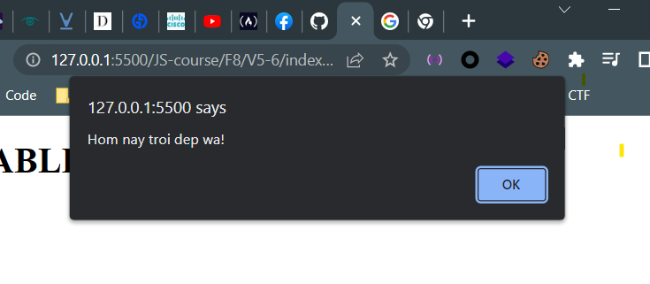
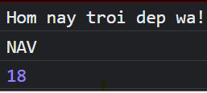
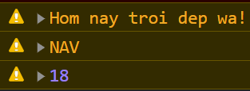
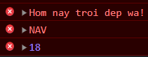
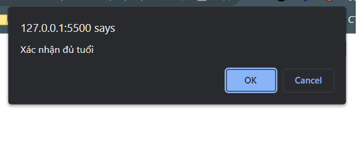
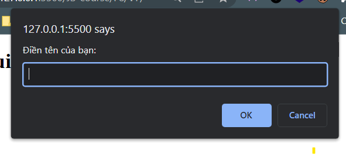
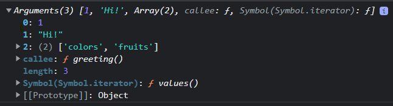
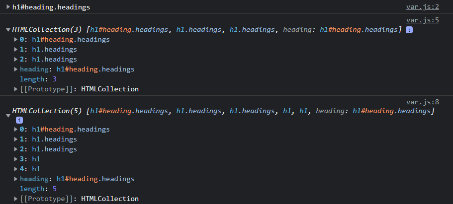

# Mục Lục:
### 1. [Biến](#bie1babfn-1)
### 2. [Comment](#comment)
### 3. [Built-in Function](#một-số-hàm-có-sẵn-thường-dùng)
### 4. [Toán tử](#toán-tử)
### 5. [Kiểu dữ liệu](#kiểu-dữ-liệu)
### 6. [Cấu trúc rẽ nhánh](#cấu-trúc-rẽ-nhánh-conditional-flow)
### 7. [Cấu trúc lặp](#cấu-trúc-lặp-repetitive-flow)
### 8. [String Deeper Dive](#string-deeper-dive)
### 9. [Number Deeper Dive](#number-deeper-dive)
### 10. [Array Deeper Dive](#array-deeper-dive)
### 11. [Hàm](#hàm-function)
### 12. [Object](#đối-tượng-object)
<br>

# **JavaScript**
- Kết thúc một câu lệnh (statement) có thể có chấm phẩy ";" hoặc không
## **Biến:**
- Sử dụng keyword `var` để ***khai báo biến***
```js
    var fullName = 'NgAwnVux'
    var age = 20
    var ngyeu // không gán value (khởi tạo) thì sẽ có value là undefined
```
- Biến ở đây là ***case-sensitive*** (phân biệt chữ hoa chữ thường)
- Bên cạnh biến, keyword `const` dùng để ***khai báo hằng***. Và khai báo hằng luôn phải đi cùng với khởi tạo hằng. Tuy nhiên không phải trình duyệt nào cũng hỗ trợ dùng `const`
- Với bản JS mới hơn (và thích ứng với hầu hết các trình duyệt), ta có thêm keyword `let` để khai báo biến, và cách này được dùng nhiều hơn


### *So sánh `let` và `var`:*
|*let*|*var*|
|-|-|
|Block-scoped|Function-scoped|
|Không cho phép tái khai báo biến|Cho phép tái khai báo biến|
|Không cho phép hoisting|Cho phép hoisting|

### *Phạm vi biến khi khai báo bởi `let` và `var`:*
- `var` chỉ cho phép biến được sử dụng trong phạm vi ***hàm***
```js
    function greet(){
        console.log(a) // trả về undefined, tức a vẫn đã được khai báo. Cái này liên quan đến Hoisting bên dưới
        var a = "Hello"
        console.log(a) // trả về giá trị của a
    }

    greet()
    console.log(a) // trả về lỗi, a chưa được khai báo (a is not defined)
```
- `let` chỉ cho phép biến được sử dụng trong phạm vi ***khối lệnh***
```js
    function greet(){
        console.log(a) // trả về lỗi, không thể sử dụng a trước khai báo nó
        let a = "Hello"
        if (a == 'Hello'){
            let b = "World"
            console.log(a + ' ' + b) // trả về được cả a và b
        }
        console.log(a) // trả về được a
        console.log(b) // trả về lỗi, b chưa được khai báo (b is not defined)
    }

    greet()
    console.log(a) // trả về lỗi, a chưa được khai báo (a is not defined)
    console.log(b) // trả về lỗi, b chưa được khai báo (b is not defined)
```

### *Tái khai báo biến (Redeclare):*
**1. Tái khai báo cùng phạm vi:**
- `var` ***cho phép*** tái khai báo
```js
    var a = 13 // a = 13
    var a = 3 // a = 3
```
- `let` ***không cho phép*** tái khai báo trong ***cùng phạm vi*** khối lệnh
```js
    let a = 13
    let a = 33 // trả về lỗi, a đã được khai báo
```

**2. Tái khai báo khác phạm vi:**
- Việc tái khai báo biến bằng `var` ở trong một phạm vi khác (dưới nó) sẽ ***làm thay đổi giá trị*** của biến trong các phạm vi phía sau
```js
    var a = 13
    console.log(a) // a = 13
    if (true){
        var a = 3
        console.log(a) // a = 3
    }
    console.log(a) // a = 3
```
- Việc tái khai báo biến bằng `let` ở trong một phạm vi khác (dưới nó) sẽ ***không làm thay đổi giá trị*** của biến trong các phạm vi phía sau
```js
    let a = 13
    console.log(a) // a = 13
    if (true){
        let a = 3
        console.log(a) // a = 3
    }
    console.log(a) // a = 3
```

**3. Tái khai báo trong vòng lặp:**
- Hệ quả là nếu sử dụng `var` trong ***loop***, giá trị của biến cũng ***thay đổi***
```js
    var a = 3
    for (var a=0; a < 13; ++a)
        console.log(a) // a chạy từ 0 đến 12
    console.log(a) // a = 13
```


- Hệ quả là nếu sử dụng `let` trong ***loop***, giá trị của biến ***không thay đổi***
```js
    var a = 3
    for (var a=0; a < 13; ++a)
        console.log(a) // a chạy từ 0 đến 12
    console.log(a) // a = 13
```

### *Hoisting:*
- Hoisting là một "tính năng" mặc định của JS, cho phép chuyển việc khai báo biến lên trên đầu phạm vi hiện tại của nó. Nói cách khác, ***biến có thể được sử dụng trước khi nó được khai báo*** (thậm chí không cần khai báo?)
```js
    x = 5
    console.log(x) // vẫn trả về bình thường, ảo vãi sò
``` 
- `var` cho phép hoisting
```js
    console.log(x) // trả về undefined
    var x
```
- `let` không cho phép hoisting. Trong phạm vi khối lệnh, nó vẫn biết sự tồn tại của biến đó (tức nó biết biến đó tồn tại), nhưng nó không cho phép việc sử dụng biến đó trước khi được khai báo
```js
    console.log(x) // trả về lỗi a không thể được dùng trước khi khai báo
    let x
```
- Hoisting chỉ cho phép leo việc khai báo biến lên đầu phạm vi, chứ không phải việc khởi tạo
```js
    console.log(x) // x = undefined
    var x = 5
    console.log(x) // x = 5
```
- Hoisting là một trong những nguyên nhân dẫn tới bug. Cần biết đến "tính năng" này có tồn tại để tránh việc bug ngoài ý muốn

## **Comment:**
- Comment 1 dòng:
```js
    // đây là comment 1 dòng
```
- Comment nhiều dòng:
```js
    /*
        Đây là comment
        nhiều dòng
    */
```
- Comment nhiều dòng và đẹp:
```js
    /**
     * Đây là comment nhiều dòng và
     * nó tự fill thêm dấu "*" ở đầu
     * dòng mỗi khi xuống dòng
    */
```

## **Một số hàm có sẵn thường dùng:**
### 1. *alert(...)* : 
- Hiện pop-up trên trang web với nội dung là tham số truyền vào
- Tham số truyền vào có thể là chuỗi, số, hoặc biến
```js 
    alert("Hom nay troi dep wa!")
    alert(varName) //name là tên biến
    alert (18) //in được cả chuỗi và số
```
<p align="center">
    
</p>

### 2. Một số hàm (method - phương thức) trong đối tượng (object) console:
- *console.log(...)* : in ra nội dung truyền vào trong tab console
```js
    console.log("Hom nay troi dep wa!")
    console.log(varName)
    console.log(18)
```
<p align="center">
    
</p>

- *console.warn(...)* : giống trên nhưng nội dung màu vàng
```js
    console.alert("Hom nay troi dep wa!")
    console.alert(varName)
    console.alert(18)
```
<p align="center">
    
</p>

- *console.error(...)* : giống trên nhưng nội dung màu đỏ
```js
    console.error("Hom nay troi dep wa!")
    console.error(varName)
    console.error(18)
```
<p align="center">
    
</p>

### 3. *confirm(...)* :
- Hiện pop-up confirm trên trang web, giống `alert()` nhưng có thêm nút
```js
    confirm("Xác nhận đủ tuổi")
    confirm(18)
    confirm(varName)
```
<p align="center">
    
</p>

### 4. *prompt(...)* :
- Hiện pop-up confirm trên trang web, giống alert nhưng có thêm phần để nhập
<p align="center">
    
</p>

### 5. *setTimeout(...)* :
- Cần 2 tham số truyền vào:
    * Tham số đầu tiên là một hàm
    * Tham số thứ hai là thời gian T, tính theo milisecond
- Dùng để thực hiện hàm này ***sau T giây*** kể từ khi dòng code này được xét đến
```js
    setTimeout(function(){
        alert("Thong bao")
    },1000)
```
- Lưu ý tham số đầu tiên phải là một hàm dạng như thế, nếu bỏ function() chỉ có alert thì bị thực hiện luôn

### 6. *setInterval(...)* :
- Cần 2 tham số truyền vào:
    * Tham số đầu tiên là một hàm
    * Tham số thứ hai là thời gian T, tính theo milisecond
- Dùng để thực hiện hàm này ***mỗi T giây*** kể từ khi dòng code này được xét đến
```js
    setInterval(function(){
        alert("Thong bao")
    },1000)
```

## **Toán tử:**
- Toán tử trong JS thực hiện các phép toán có độ ưu tiên lớn hơn trước, sau đó sẽ thực hiện lần lượt từ ***trái qua phải***
### *1. Toán tử số học (Arithmetic Operators):*
```js
    var sum = 1+2 //cộng
    var substract = 1-2 //trừ
    var mul = 1*2 //nhân
    var div = 1/2 //chia
    var exp = 1**2 //mũ
    var mod = 1%2 //chia lấy phần dư
    ++sum //increment
    --sum //decrement
```
- Toán tử chia "/" trả về giá trị thực
- Toán tử cộng "+" còn có thể dùng để ***ghép chuỗi*** (concatenation operator)
```js
    var string = "hello" + ' ' + "world"
    console.log(string) // "hello world"
```
- Toán tử cộng "+" cũng có thể cộng chuỗi và số, kết quả trả về là một chuỗi
```js
    var x = 5
    var y = "hello"
    console.log(x+y) // "5hello"
    var a = 16 + 4 + "Raiden" // "20Raiden"
    var b = "Raiden" + 16 + 4 // "Raiden164"
```
- Toán tử increment và decrement cũng có tiền tố và hậu tố

### *2. Toán tử gán (Assignment Operators):*
```js
    var a = "string" // gán chuỗi
    var b = 18 // gán số
    a = b // gán a bằng b
    b += 2 // b = b + 2
    b -= 2 // b = b - 2
    b *= 2 // b = b * 2
    b /= 2 // b = b / 2
    b %= 2 // b = b % 2
    b **= 2 // b = b ** 2
```

### *3. Toán tử so sánh (Comparison Operators):*
```js
    a == b // nếu a bằng b
    a === b // nếu a bằng b và có cùng kiểu dữ liệu với b
    a != b // nếu a khác b
    a !== b // nếu a khác b và khác kiểu dữ liệu với b
    a > b // nếu a lớn hơn b
    a >= b // nếu a lớn hơn hoặc bằng b
    a < b // nếu a nhỏ hơn b
    a <= b // nếu a nhỏ hơn hoặc bằng b
    Toán tử ba ngôi mà quên rồi
```
- Toán tử so sánh chặt:
```js
    5 == '5' // true do cùng giá trị
    5 === '5' // false do khác kiểu dữ liệu
    5 != '5' // false do cùng giá trị
    5 !== '5' // true do khác kiểu dữ liệu
```

### *4. Toán tử logic (Logical Operators):*
```js
    a && b // và - and
    a || b // hoặc - or
    !a // phủ định - negation/not
```

### *5. Toán tử bitwise (Bitwise Operators) (biết là nó có tồn tại thôi)*

### *6. Toán tử ba ngôi:*
- Cấu trúc:
```js
    condition ? trueExpression : falseExpression
```

## **Kiểu dữ liệu:**
- Sử dụng toán tử `typeof()` để trả về kiểu dữ liệu của tham số truyền vào
```js
    console.log(typeof("hello")) // string
    console.log(typeof(18)) // number
    console.log(typeof(18n)) // bigint
    console.log(typeof(a)) // undefined
```
### *1. String:*
- Chuỗi có thể nằm trong nháy kép hoặc nháy đơn hoặc backtick "`"
```js
    let a = "Hello"
    let b = 'World'
    let c = `hehe`
```
- Backtick được sử dụng nhiều khi chèn thêm biến hoặc expression (biểu thức) vào chuỗi bằng cách sử dụng ${...} (Cách này gọi là ***String Template***)
```js
    let name = "Vu"
    let age = 18
    let result = `I am ${name} and I am ${age} years old`
```

### *2. Number:*
- Đại diện cho số nguyên và số thực
```js
    let num1 = 3
    let num2 = 3.3
    let num3 = 3e5 // 3 * 10^5
```
- Ngoài ra còn có các giá trị như Infinity, -Infinity và NaN (Not a Number)
```js
    let num1 = 3/0 // Infinity
    let num2 = -3/0 // -Infinity
    let num3 = "abc"/2 // NaN
```

### *3. BigInt:*
- Đại diện cho số nguyên rất lớn
- Được hình thành bằng cách thêm chữ "n" ở cuối
```js
    let num1 = 900719925124740998n
    let result1 = num1 + 1n // 900719925124740999n
    let result2 = num1 + 1 // trả về lỗi
```

### *4. Boolean:*
- Chỉ có 2 giá trị: true hoặc false
```js
    let isNumber = true
    let isChar = false
```
- Các giá trị sau được tự động coi là sai:
    * Số 0
    * false
    * Chuỗi rỗng: '' hoặc ""
    * Undefined
    * NaN
    * null

### *5. Undefined:*
- Là giá trị của biến khi được khai báo mà không được khởi tạo
```js
    let a // a = undefined
```

### *6. Null:*
- Là giá trị đặc biệt, đại diện cho sự "trống" hoặc "giá trị chưa biết"
```js
    let a = null
```
### *7. Symbol (chưa dùng nhiều nên nói sau)*
### *8. Object:*
- Tập hợp các cặp key-value
- Được khai báo bằng cặp ***ngoặc nhọn***
- Mỗi cặp giá trị được gọi là ***property*** (thuộc tính)
```js
    let student = {
        name: "Raiden",
        class: 12,
        GPA: 9.6
    }
```

### *9. Array:*
- Giống Object, nhưng key được đánh số tự động từ 0
- Được khai báo bằng cặp ***ngoặc vuông***
```js
    let myArray = ['JavaScript', 'PHP', 'Python']
```

## **Cấu trúc rẽ nhánh (Conditional flow):**
- Cú pháp if ... else if ... else:
```js
    if (statement){
        // code block
    }else if(statement){
        // code block
    }else{
        // code block
    }
```
- Cấu trúc switch:
```js
    switch(variable/expression){
        case value1:
            // code block 1
            break
        case value2:
            // code block 2
            break
        // ...
        default:
            // default code block
    }
```

## **Cấu trúc lặp (Repetitive flow):**
### *Vòng for:*
```js
    for (initialization; condition; updateNewValue){
        // code block
    }
    // For example:
    for (let i=0; i<10; ++i)
        console.log(i)
    /*
        1
        2
        3
        4
        5
    */
```
### *Vòng for/in:*
- Dùng để ***duyệt key*** của đổi tượng
```js
    for (let iterator in objectName){
        // code block
    }
    // For example:
    let myInfo = {
        name: "Vu",
        age: 20,
        address: "Hanoi, Vietnam"
    }
    for (let key in myInfo){
        console.log(key)
    }
    /*
        "name"
        "age"
        "address"
    */
   // Ứng dụng: lấy value
   for (let key in myInfo){
        console.log(myInfo[key])
    }
    /*
        "Vu"
        20
        "Hanoi, Vietnam"
    */
```
### *Vòng for/of:*
- Dùng để ***duyệt value*** của đối tượng, phần tử trong mảng, ký tự trong chuỗi
```js
    for (let iterator of objectName){
        // code block
    }
    // For example:
    let color = ["red", "green", "blue"]
    for (let value of color){
        console.log(value)
    }
    /*
        "red"
        "green"
        "blue"
    */
```

### *Vòng while:*
```js 
    while (expression)
    // For example:
    let i=0
    while (1<=10){
        console.log(i)
        i++
    }
```

### *Vòng do/while:*
```js
    let i=0
    do{
        console.log(i)
        i++
    }while (i<=10)
```
### *Break và continue:*
- `break` dùng để kết thúc vòng lặp
- `continue` dùng để kết thúc lần lặp hiện tại

## **String Deeper Dive:**
- Có 2 cách để tạo chuỗi:
```js
    let a = "Raiden" // kiểu dữ liệu chuỗi
    let b = new String("Raiden") // kiểu dữ liệu object
```
- Cách escape ký tự đặc biệt: sử dụng backslash "\\"
```js
    let a = 'I\'m Raiden'
    let b = "The phrase \"...\" is inappropriate"
```
- Cách xem độ dài chuỗi: sử dụng ***thuộc tính*** `length`
```js
    let a = "Raiden"
    console.log(a.length) // 6
```
- Tìm vị trí/chỉ số của một ký tự/chuỗi: sử dụng ***phương thức*** `indexOf(string, num=0)` với string là tham số ứng với ký tự/chuỗi cần tìm, num là vị trí/chỉ số bắt đầu tìm kiếm (nếu để rỗng thì tìm từ đầu, tức từ chỉ số 0). Nó sẽ trả về ***vị trí/chỉ số đầu tiên*** từ trái sang nếu tìm thấy ký tự/chuỗi. Nếu không có, trả về -1. Có phương thức tương tự là `lastIndexOf(string)` nhưng tìm vị trí/chỉ số cuối cùng
```js
    let a = "Raidenn"
    //       0123456
    console.log(a.indexOf('r')) // -1
    console.log(a.indexOf('R')) // 0
    console.log(a.indexOf('i')) // 2
    console.log(a.indexOf('en')) // 4
    console.log(a.indexOf('em')) // -1
    console.log(a.indexOf('n')) // 5
    console.log(a.lastIndexOf('n')) // 6
```
- Cắt chuỗi con từ một chuỗi: sử dụng phương thức `slice(start, end)` với start là vị trí bắt đầu cắt, còn end là vị trí kết thúc cắt (nhưng không tính tại vị trí này). Nếu không có tham số end thì cắt từ start đến hết. Còn không có cắt hết cả hai thì coi như không cắt gì cả. Nếu chỉ số là âm thì sẽ là cắt ngược từ cuối lên
```js
    let a = "Raiden"
    console.log(a.slice(1,3)) // "ai"
    console.log(a.slice(3)) // "den"
    console.log(a.slice()) // "Raiden"
    console.log(a.slice(3,1)) // "" - chuỗi rỗng
    console.log(a.slice(-3,-1)) // "de"
    console.log(a.slice(-3)) // "den"
```
- Thay thế ký tự/chuỗi thành ký tự/chuỗi con mới: sử dụng phương thức `replace(string,newString)` với string là ký tự/chuỗi cần thay thế, newString là ký tự/chuỗi mới. Nếu tham số đầu là ***biểu thức chính quy***, nó sẽ thay thế tất cả các ký tự/chuỗi mà nó tìm thấy
```js
    let a = "Raidenn"
    console.log(a.replace("ai", "ay")) // "Raydenn"
    console.log(a.replace("n", "l")) // "Raideln"
    console.log(a.replace(/n/g, "l")) // "Raidell"
    //                      ^___ Biểu thức chính quy
```
- Chuyển chuỗi thành in hoa/in thường: sử dụng phương thức lần lượt là `toUpperCase()` và `toLowerCase()`
```js
    let a = "Raidenn"
    console.log(a.toUpperCase()) // "RAIDENN"
    console.log(a.toLowerCase()) // "raidenn"
```
- Loại bỏ khoảng trắng thừa ở hai đầu chuỗi: sử dụng phương thức `trim()`
```js
    let a = "   Raiden   "
    console.log(a + ' ' + a.length) // "   Raiden    12"
    console.log(a.trim() + ' ' + a.trim().length) // "Raiden 6"
```
- Chuyển chuỗi thành array: sử dụng phương thức `split(separator)` với separator là ký tự/chuỗi ngăn cách các thành phần mình muốn là phần tử của array
```js
    let languages = "PHP, Python, Java"
    console.log(languages.split(", ")) // ["PHP", "Python", "Java"]
    let a = "Raiden"
    console.log(a.split("")) // ["R", "a", "i", "d", "e", "n"]
```
- Truy cập phần tử tại vị trí xác định: sử dụng `charAt(index)` với index là chỉ số trong chuỗi. Ngoài ra có thể sử dụng ngoặc vuông giống mảng
```js
    let a = "Raiden"
    console.log(a.charAt(4)) // "e"
    console.log(a.charAt(6)) // ""
    console.log(a[4]) // "e"
    console.log(a[6]) // undefined
```

## **Number Deeper Dive:**
- Có 2 cách để tạo số:
```js
    let a = 13
    let b = new Number(13)
```
- Nếu thực hiện phép tính không hợp lệ, kết quả sẽ trả về NaN (Not a Number)
```js
    let result = 13/"abc"
    console.log(result) // NaN
    console.log(typeof result) // Number
```
- Để kiểm tra một giá trị có phải NaN hay không, ta không thể sử dụng phép so sánh mà phải sử dụng hàm isNaN()
```js
    console.log(result == NaN) // false
    console.log(isNaN(result)) // true
```
- Để chuyển số thành chuỗi: sử dụng phương thức `toString()`
```js
    let a = 13
    console.log(a.toString()) // "13"
```
- Để làm tròn số thập phân: sử dụng phương thức `toFixed(num)` với num và số chữ số được làm tròn sau dấu phẩy. Cần lưu ý là sau khi làm tròn số bằng `toFixed()`, số sẽ được chuyển thành chuỗi
```js
    let a = 3.13
    console.log(a.toFixed()) // 3
    console.log(a.toFixed(1)) // 3.1
```

## **Array Deeper Dive:**
- Có 2 cách để tạo array:
```js
    let colors = ["red", "green", "blue"]
    colors = new Array("red", "green", "blue")
```
- Các phần tử trong array không cần phải cùng kiểu dữ liệu
- Để phân biệt kiểu dữ liệu Array và Object, ta sử dụng phương thức Array.isArray(var) với var là biến cần kiểm tra. Ta không sử dụng được typeof do nó cùng trả về là Object
```js
    console.log(Array.isArray(colors))
```
- Để xem độ dài của mảng: sử dụng thuộc tính `length`
```js
    console.log(colors.length) // 3
```
- Để truy cập phần tử tại chỉ số nhất định: sử dụng dấu ngoặc vuông
```js
    console.log(colors[0]) // "red"
    console.log(colors[2]) // "blue"
```
- Để chuyển array thành chuỗi: sử dụng phương thức `toString`. Các phần tử sẽ được ghép với nhau bằng dấu phẩy. Để thay đổi dấu phẩy thành ký tự khác, sử dụng phương thức `join(seperator)`
```js
    console.log(colors.toString()) // "red,green,blue"
    console.log(colors.join()) // "red,green,blue"
    console.log(colors.join("-")) // "red-green-blue"
```
- Để xóa phần tử cuối của mảng: sử dụng phương thức `pop()`. Ngoài ra nó còn trả về chuỗi mà nó xóa. Nếu mảng rỗng mà vẫn dùng `pop()`, nó trả về undefined. Còn để xóa phần tử đầu của mảng, sử dụng phương thức `shift()`
```js
    console.log(colors.pop()) // "blue"
    console.log(colors) // ["red", "green"]
    consoloe.log(colors.shift()) // "red"
    console.log(colors) // ["green"]
    let a = []
    console.log(a.pop()) // undefined
    console.log(a.shift()) // undefined
```
- Để thêm phần tử vào cuối mảng: sử dụng phương thức `push()`. Ngoài ra nó còn trả về đọ dài mới của mảng. Để thêm phần tử vào đầu mảng, sử dụng phương thức `unshift()`
```js
    console.log(colors.push("yellow", "purple")) // 5
    console.log(colors) // ["red", "green", "blue", "yellow", "purple"]
    console.log(colors.unshift("grey")) // 6
    console.log(colors) // ["grey", "red", "green", "blue", "yellow", "purple"]
```
- Phương thức `splice(start, num, item)`: start là vị trí đặt chỉ số trong mảng, num là số phần tử mà hàm sẽ xóa từ vị trí start, item là phần tử để chèn thêm vào mảng
```js
    // mỗi dòng sẽ ứng với colors = ["red", "green", "blue"]
    colors.splice(1,1) // ["red", "blue"]
    colors.splice(1,0) // ["red", "green", "blue"]
    colors.splice(1,2,"grey","yellow") // ["red", "grey","yellow"]
```
- Để nối 2 array với nhau: sử dụng phương thức `concat()`
```js
    colors = ["red", "green", "blue"]
    colors2 = ["yellow", "grey"]
    console.log(colors.concat(colors2)) // ["red", "green", "blue", "yellow", "grey"]
```
- Cắt mảng con từ một mảng: sử dụng phương thức `slice(start, end)` với start là vị trí bắt đầu cắt, còn end là vị trí kết thúc cắt (nhưng không tính tại vị trí này). Nếu không có tham số end thì cắt từ start đến hết. Còn không có cắt hết cả hai thì coi như không cắt gì cả. Nếu chỉ số là âm thì sẽ là cắt ngược từ cuối lên
```js
    console.log(colors.slice(1,2)) // ["green"]
    console.log(colors.slice(1)) // ["green", "blue"]
    console.log(colors.slice()) // ["red", "green", "blue"]
```
### *Một số phương thức nâng cao hơn của Array thường dùng để duyệt từng phần tử thông qua callback function:*
- `forEach()`: thực hiện hàm truyền vào nó với số lần bằng số phần tử của mảng → hầu hết được sử dụng để duyệt phần tử. Hàm truyền vào có thể được truyền thêm 2 tham số: tham số thứ nhất là ***giá trị*** của từng phần tử, tham số thứ hai là ***chỉ số*** của phần tử tương ứng
```js
    let colors = ["red", "green", "blue"]
    colors.forEach(function(color, index){
        console.log(index, color)
    })
    /*
        0 "red"
        1 "green"
        2 "blue"
    */
```
- `every()`: kiểm tra xem tất cả phần tử của mảng có thỏa mãn một điều kiện nào đó hay không với tham số truyền vào là 1 hàm, và hàm đó có 1 tham số là ***giá trị*** của phần tử
```js
    let colors = ["red", "green", "blue"]
console.log(colors.every(function(color){
    return color.length > 2
}))
    // true vì tất cả phần tử trong mảng đều có length > 2
```
- `some()`: kiểm tra xem có tồn tại phần tử của mảng có thỏa mãn một điều kiện nào đó hay không với tham số truyền vào là 1 hàm, và hàm đó có 1 tham số là ***giá trị*** của phần tử
```js
    let colors = ["red", "green", "blue"]
console.log(colors.some(function(color){
    return color.length > 4
}))
    // true vì tất cả phần tử trong mảng đều có length > 2
```
- `find()`: tìm phần tử đầu tiên trong mảng thỏa mãn điều kiện nào đó. Nếu tồn tại thì trả về phần tử đó, không thì trả về undefined
```js
    let colors = ["red", "green", "blue"]
console.log(colors.find(function(color){
    return color.length > 4
}))
    // "green"
```
- `filter()`: lọc tất cả phần tử trong mảng thỏa mãn điều kiện nào đó. Nếu tồn tại thì trả về mảng chứa các phần tử đó, không thì trả về mảng rỗng
```js
    let colors = ["red", "green", "blue"]
console.log(colors.filter(function(color){
    return color.length > 3
}))
    // ["green", "blue"]
```
- `map()`
- `reduce()`

## **Hàm (Function):**
- Sử dụng keyword `function` để định nghĩa hàm, theo sau là tên hàm và cặp ngoặc tròn
```js
    function functionName(){
        // code
    }
```
- Trong cặp ngoặc tròn có thể có tham số (parameter). Khi gọi hàm và truyền giá trị cho tham số của hàm, giá trị đó được gọi là đối số (argument)
```js
    function greeting(message){
        console.log(message)
    }
    greeting("Hi!")
```
- Nếu truyền ít đối số hơn lượng tham số của hàm, JS sẽ mặc định các tham số còn lại là ***undefined***. Còn để set giá trị cho tham số mặc định, ta gán trực tiếp nó với giá trị mặc định ta muốn
```js
    function greeting(message, message2){
        console.log(message) // "Hi!"
        console.log(message2) // undefined
    }
    function greeting2(message = "Hello", message2 = "World"){
        console.log(message) // "Hi"
        console.log(message2) // "World"
    }
    greeting("Hi!")
    greeting2("Hi")
```
- Nếu 2 hàm được đặt tên giống nhau, hàm được định nghĩa sau sẽ ghi đè lên hàm trùng tên của nó (chứ không có lỗi)
```js
    function sum(a,b){
        return a+b
    }
    function sum(a,b){
        return a-b
    }
    let a = sum(6,3) // 3
```
- Ta hoàn toàn có thể định nghĩa hàm trong hàm, và hàm bên trong cũng chỉ được sử dụng trong phạm vi của hàm chứa nó
```js
    function sum(a,b){
        function sub(a,b){
            return a-b
        }
        return a+b-sub(a,b)
    }
    console.log(sum(a,b)) // 6
```

### *Đối tượng **arguments**:*
- Được dùng để truyền không giới hạn đối số vào hàm, giá trị các đối số sẽ được lưu trong đối tượng `arguments` dưới dạng phần tử của mảng
```js
    function greeting(){
    console.log(arguments)
    console.log(arguments[2]) // trả về mảng ["colors", "fruits"]
}
    greeting(1, "Hi!", ["colors", "fruits"])
```
<p align="center">
    
</p>

### *Duyệt các phần tử trong đối tượng **arguments** bằng vòng lặp **for of**:*
```js
    function greeting(){
        for (let i of arguments)
            console.log(i)
        // 1
        // 2
        // 3
    }
    greeting(1,2,3)
```

### *Keyword **return**:*
- Keyword `return` giúp trả về giá trị mình muốn khi xử lý trong hàm. Nếu không sử dụng return, mặc định sẽ trả về undefined
```js
    function sum(a,b){
        return a + b;
    }
    let tong = sum(13,3) // 16
```
- `return` có thể trả về bất cứ cái gì, kể cả mảng
```js
    function try(a,b){
        return [a,b]
    }
    let a = try(13,3) // [13,3]
```
- Hàm trong JS cũng có thể đệ quy:
```js
    function ba(a){
        if (a < 1)
            return 0
        else
            return a + ba(a-1)
    }
    let a = ba(5) // a=15
```

### *Các loại hàm:*
1. Declaration function:
- Cần phải có tên hàm
- Có hỗ trợ hoisting (có thể sử dụng hàm trước khi nó được định nghĩa)
```js
    greeting("Hello")   // hỗ trợ hoisting
    //             ____ bắt buộc
    //            |
    function greeting(message){
        console.log(message)
    }
```

2. Expression function:
- Không cần có tên hàm (tức có cũng chả sao)
- Không hỗ trợ hoisting
```js
    //                      ___ optional
    //                     |
    let greeting = function(message){
        console.log(message)
    }
    greeting("Hello")
```

3. Arrow function: (Chưa học đến)

### *Callback:*
- Là một hàm được truyền trong một hàm khác với vai trò như một đối số
```js
    function myFunction(param){
        param(123)
    }
    function myCallback(value){
        console.log(value)
    }
    myFunction(myCallback)
    // 123
```

## **Đối tượng (Object):**
- Cách khởi tạo và truy cập đến các thuộc tính/phương thức của đối tượng:
```js
    let gpaKey = "gpa"
    let student = {
        name: "Vu",
        age: 18,
        'quote': "slay",
        [gpaKey]: 3.8, // cách thêm thuộc tính cho đối tượng bằng giá trị của biến
        getName: function(){
            return this.name
        }
    }
    student.email = "mail@example.com" // cách thêm thuộc tính cho đối tượng
    let key = 'age'
    console.log(student.name)
    console.log(student['quote']) // cách này thường dùng để truy cập những key có dạng chuỗi
    console.log(student[key]) // cách này để truy cập vào thuộc tính thông qua biến bên ngoài

    let name = student.getName()
    console.log(name) // "Vu"
```
- Cách xóa thuộc tính trong đối tượng: sử dụng keyword `delete`
```js
    delete student.age
    delete student['quote']
```

### *Object Constructor:*
- Cơ bản là một hàm, sử dụng để tạo một đối tượng
- Sử dụng từ khóa `new` để tạo đối tượng bằng constructor
```js
    // constructor cho object User
    function User(name, city, age){
        this.name = name
        this.email = email
        this.age = age
    }
    let user1 = new User("Vu", "Hanoi", 20)
    let user2 = new User("John", "US", 18)
```

### *Object prototype:*
- Là một thuộc tính có sẵn trong mọi đối tượng
- Được dùng để thêm thuộc tính/phương thức vào constructor của đối tượng
- Cú pháp: ***&lt;tên đối tượng>.prototype.&lt;key> = value***
```js
    function User(first, last, age){
        this.firstName = first
        this.lastName = last
        this.age = age
        this.getName = function(){
            return `${this.firstName} ${this.lastName}`
        }
    }
    User.prototype.class = "Math" // thêm thuộc tính
    User.prototype.getClass = function(){
        return this.class
    } // thêm phương thức
    let user = new User("Vu", "Nguyen", 20)
    console.log(user.class) // "Math"
    console.log(user.getClass()) // "Math"
```
- Thuộc tính/phương thức được thêm vào sẽ không nằm trực tiếp ở đối tượng, mà nó nằm trong thuộc tính prototype của đối tượng

### *Date Object:*
- Là một built-in object trong JS
- Cách tạo:
```js
    let date = new Date()
    console.log(date) // trả về thời gian hiện tại
```
- Một vài phương thức:
```js
    let date = new Date()
    let year = date.getFullYear() // trả về năm hiện tại
    let month = date.getMonth() // trả về từ 0 đến 11, ứng với tháng hiện tại - 1
    let day = date.getDate() // trả về ngại hiện tại
    let hour = date.getHours() // trả về giờ hiện tại
    let minute = date.getMinutes() // trả về phút hiện tại
    let second = date.getSecond() // trả về giây hiện tại
```
- Tham khảo thêm tại [đây](https://developer.mozilla.org/en-US/docs/Web/JavaScript/Reference/Global_Objects/Date)

## **HTML DOM (Document Object Model):**
- Là một mô hình đối tượng được quy chuẩn, là giao diện lập trình cho HTML. Các thành phần trong HTML đều được coi là Object
- Được JS dùng để thêm, sửa, xóa, lấy ra các thành phần trong HTML
### *Các cách lấy element:*
```js
    document.getElementByID("<tên ID>") // trả về element
    document.getElementsByClassName("<tên class>") // trả về 1 HTMLCollection (giống mảng) các element
    document.getElementsByTagName("<tên tag>") // trả về 1 HTMLCollection (giống mảng) các element
```
<p align="center">
    
</p>