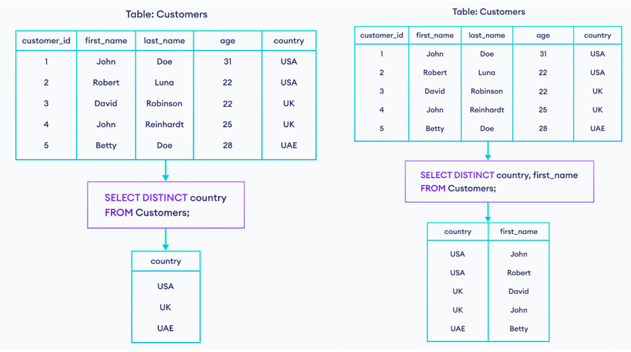
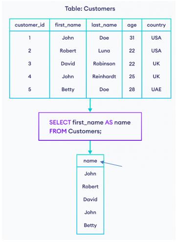

# **SELECT statement:**
## ***SELECT(1):***
### *1. SELECT ... FROM ...* 
- Để lấy ***dữ liệu nào đó*** (tên cột) từ bảng:

`SELECT <tên cột 1>, <tên cột 2>, ... FROM <tên bảng>` 
#### Ví dụ:
```sql
    SELECT First_name, Last_name FROM Customers; 
    -- Lấy dữ liệu trong cột First_name, Last_name ở bảng Customers
```
- Để lấy ***tất cả dữ liệu*** từ bảng:

`SELECT * FROM <tên bảng>`
### *2. SELECT ... FROM ... WHERE ...*
- Để lấy dữ liệu phụ thuộc vào ***điều kiện*** nào đó:

`SELECT * FROM <tên bảng> WHERE <điều kiện>`
#### Ví dụ:
```sql
    SELECT * FROM Customers WHERE Last_name = 'Nguyễn' 
    -- Lấy tất cả dữ liệu ở bảng Customers mà có giá trị ở cột Last_name bằng 'Nguyễn'
```
- `<điều kiện>` trong vế `WHERE` có thể kết hợp với các toán tử như "=", các toán tử logic "<,>" hoặc AND, OR, NOT (tham khảo ở phần Operator)

### *3. SELECT DISTINCT ...* 
- Để lấy dữ liệu từ cột mà các giá trị trong hàng phải khác nhau:

`SELECT DISTINCT <tên cột> FROM <tên bảng> WHERE <điều kiện>`
#### Ví dụ:
<p align="center">
    
</p>

- Có thể kết hợp với hàm `COUNT()` để đếm các dữ liệu khác nhau:

`SELECT COUNT(DISTINCT <tên cột>) FROM <tên bảng> WHERE <điều kiện>`

### *4. SELECT ... AS ...*
- Dùng để đổi tên tạm thời cho cột hoặc bảng để sử dụng lúc sau. Cú pháp:

`SELECT <tên cột 1> AS <tên cột mới 1>, <tên cột 2> AS <tên cột mới 2>... FROM <tên bảng>`
#### Ví dụ:
<p align="center">
    
</p>

### *5. LIMIT/TOP/FETCH FIRST*
- 3 từ khóa trên có tác dụng tương đương nhau, nhưng tùy RDBMS sẽ hỗ trợ cái nào
- Được dùng để lấy `n` hàng đầu tiên trong câu lệnh SELECT (n là một số tương ứng trong cú pháp)
#### a. TOP:
- RBDSM hỗ trợ: SQL Server, MS Access
- Cú pháp:

`SELECT TOP <số hàng> <tên cột> FROM <tên bảng>`

#### Ví dụ:
```sql
    SELECT TOP 2 First_name, Last_name from Customers
```

#### b. LIMIT:
- RBDSM hỗ trợ: MySQL, PostgreSQL, SQLite
- Cú pháp:

`SELECT <tên cột> FROM <tên bảng> LIMIT <số hàng> OFFSET <số hàng>`
- Câu lệnh này còn hỗ trợ từ khóa `OFFSET`, dùng để tính từ hàng số bao nhiêu để từ khóa `LIMIT` có tác dụng

#### Ví dụ:
```sql
    SELECT First_name, Last_name FROM Customers LIMIT 2 OFFSET 3
    -- Lấy 2 hàng kể từ hàng thứ 3 trở đi (tức lấy hàng 4,5)
```

#### c. FETCH FIRST:
- RBDSM hỗ trợ: Oracle
- Cú pháp:

`SELECT tên cột> FROM <tên bảng> FETCH FIRST <số hàng> ROWS ONLY`

#### Ví dụ:
```sql
    SELECT * FROM Customers FETCH FIRST 2 ROWS ONLY
```

### *6. IN*
- Là toán tử dùng với từ khóa `WHERE` để tạo ra một danh sách các giá trị (khá giống với các toán tử OR lồng nhau)
- Cú pháp:

`SELECT <tên cột> FROM <tên bảng> WHERE <tên cột> IN (<danh sách giá trị>)`

#### Ví dụ:
```sql
    SELECT * FROM Customers WHERE country IN ('VN', 'USA')
    -- chọn tất cả hàng với giá trị của cột country là VN hoặc USA
    SELECT * FROM Customers WHERE 'VN' IN (country)
    -- chọn tất cả hàng với giá trị của cột country là VN
```

- Có thể dùng kết hợp với từ khóa `NOT` để không lựa chọn các hàng có trong danh sách các giá trị
```sql
    SELECT * FROM Customers WHERE country NOT IN ('VN', 'USA')
    -- chọn tất cả hàng mà KHÔNG có giá trị của cột country là VN hoặc USA
```

### *7. BETWEEN*
- Là toán tử dùng với từ khóa `WHERE` để tạo ra một đoạn giá trị (thường áp dụng với số)
- Cú pháp:

`SELECT <tên cột> FROM <tên bảng> WHERE <tên cột> BETWEEN <số đầu> AND <số cuối>`
#### Ví dụ:
```sql
    SELECT * FROM Customers WHERE price BETWEEN 300 AND 500
    -- chọn tất cả hàng với giá trị của cột price nằm trong đoạn 300 và 500
```

### *8. IS NULL and IS NOT NULL*
- Dùng với `WHERE` để lấy các hàng có giá trị trong cột là NULL - giá trị đặc biệt chỉ sự "trống". Khác với hầu hết các loại ngôn ngữ khác, `0` và `''` (xâu rỗng) ***không được*** tính là NULL
#### Ví dụ:
```sql
    SELECT * FROM Customers WHERE price IS NULL
    -- chọn tất cả hàng với giá trị của cột price được đánh là NULL
```
- Ngược lại với cái trên là `IS NOT NULL`, chọn các hàng có giá trị trong cột khác NULL
```sql
    SELECT * FROM Customers WHERE price IS NOT NULL
    -- chọn tất cả hàng với giá trị của cột price khác NULL
```

### *9. Aggregate functions:*
- Là một số hàm được xây dựng sẵn để thực hiện một số nhiệm vụ nào đó lên các giá trị của hàng
#### a. MAX()/MIN():
- Dùng để trả về giá trị max/min trong một cột
- 2 hàm này có thể áp dụng với cột chứa dữ liệu kiểu string/text, và nó sẽ trả về dựa trên thứ tự từ điển của string/text đó
- Cú pháp:

`SELECT MAX(<tên cột>)/MIN(<tên cột>) FROM <tên bảng>`
#### Ví dụ:
```sql
    SELECT MAX(age) FROM Customers
    -- trả về giá trị max trong cột age
    SELECT MIN(age) FROM Customers
    -- trả về giá trị min trong cột age
```
- Để lấy được dữ liệu dựa trên min/max của cột nào đó, có thể kết hợp như ví dụ sau:
```sql
    SELECT * FROM Customers WHERE age = (SELECT MIN(age) FROM Customers)
```

#### b. COUNT():
- Dùng để đếm số hàng mà câu lệnh `SELECT` trả về
- Để trả về tất cả hàng trong bảng:

`SELECT COUNT(*) FROM <tên bảng>`
- Kết hợp với `SELECT`:

`SELECT COUNT(<tên cột>) FROM <tên bảng> WHERE <điều kiện>`

#### Ví dụ:
```sql
SELECT COUNT(country) AS customers_in_UK FROM Customers WHERE country = 'UK';
```

- Đếm số dữ liệu khác nhau trong một

#### c. SUM()/AVG():
- 2 hàm này chỉ áp dụng với cột có giá trị số, dùng để tính tổng/giá trị trung bình
- Cú pháp:

`SELECT SUM(<tên cột>)/AVG(<tên cột>) FROM <tên bảng>`